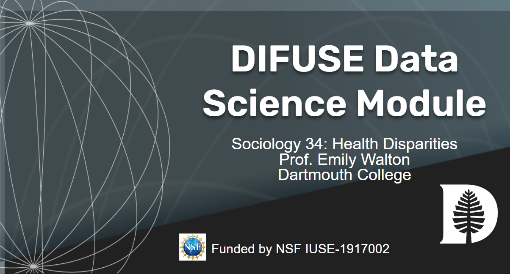

# Sociology: Health Disparities DIFUSE Module 

## Contributors: Katherine Lasonde ('23), Kyra McLaughlin ('23), Osman Khan (Data Visualization Fellow, DALI Lab), Emily Walton (Professor of Sociology) Scott Pauls (PI, Professor of Mathematics)

This module was developed through the DIFUSE project at Dartmouth College and funded by the National Science Foundation award IUSE-1917002.

 This work is licensed under a <a rel="license" href="http://creativecommons.org/licenses/by-sa/4.0/">Creative Commons Attribution-ShareAlike 4.0 International License</a>.

## Module Description 
Health Disparities (Sociology 34) explores the interrelations between health outcomes and key socialogical concepts such as race, wealth, gender, and other social determinants of health. This module provides a portal for students to explore these data easily both visually and statistically. The four components help students explore relationships between health outcomes and different social determinants of health in the State of Texas through visualizations of bivariate data that allow them to generate and/or test hypotheses.  This is coupled with a regression tool that allows a deeper statistical interrogation. The module covers data science areas of analyzing data, visualizing data, drawing conclusions, and communicating data.

(<a href="https://github.com/difuse-dartmouth/.github/blob/8f8f6efff8943871e1fcaa3b6f2daf1531206df6/profile/howto.md">What does this badge mean?</a>)

For instructors and interested parties, the history of this repository (with detailed commits), can be found [here](https://github.com/difuse-dartmouth/SOCY34_F21/commits/main/).

