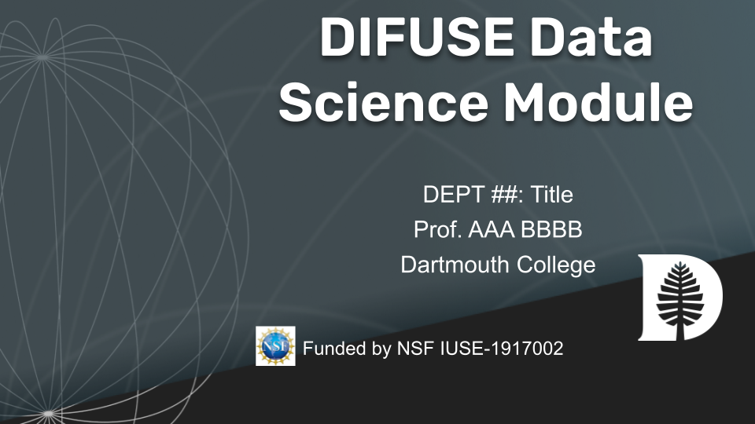

# ABCD 00 DIFUSE Module 

## Contributors: Jane Doe ('24), Muhammad Aronno ('23), and Professor Craig Silsby (PI) 

## Module Description 
This module is used to learn and then apply dyad interaction modeling using an R-based programming module, with the help of the package 'dyAddon' and open-sourced datasets from the Data of Sets.

This module was developed through the DIFUSE project at Dartmouth College and funded by the National Science Foundation award IUSE-1917002.

 This work is licensed under a <a rel="license" href="http://creativecommons.org/licenses/by-sa/4.0/">Creative Commons Attribution-ShareAlike 4.0 International License</a>.

(<a href="https://github.com/difuse-dartmouth/.github/blob/8f8f6efff8943871e1fcaa3b6f2daf1531206df6/profile/howto.md">What does this badge mean?</a>)

## [Click here for module materials](completed_module/README.md)

For instructors and interested parties, the history of this repository (with detailed commits), can be found [here](https://github.com/difuse-dartmouth/data-migration-template/commits/main/).

## Folder Structure

The folder *completed_module* contains all of the module components.  

The *components* subfolder contains ...

The *data* subfolder contains ...

The *logistics* subfolder contains ...
